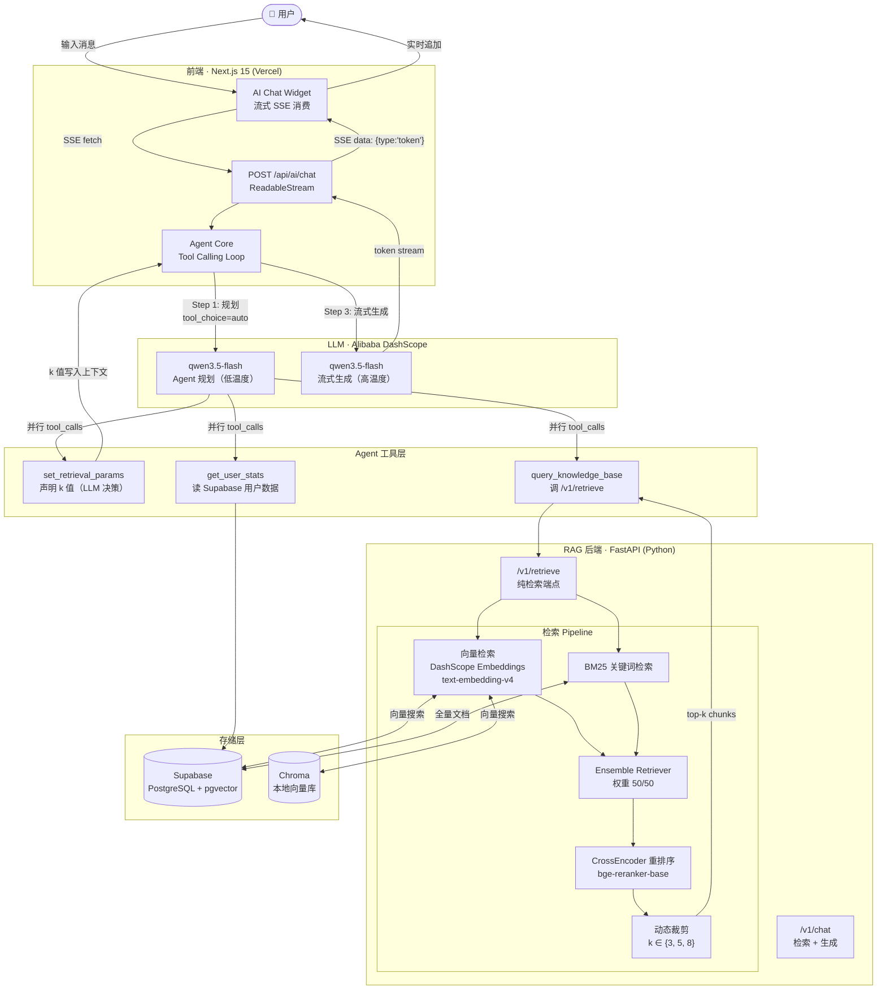

# FitCore — AI-Powered Fitness Coaching Platform

> 基于 RAG + Agent Tool Calling 的全栈 AI 健身教练平台

**Live Demo:** [fitcore-web-eight.vercel.app](https://fitcore-web-eight.vercel.app/)

---

## Architecture



---

## Tech Stack

| 层级 | 技术 |
|---|---|
| **前端框架** | Next.js 15 · React 19 · TypeScript |
| **UI / 样式** | Tailwind CSS 4 · Radix UI · shadcn/ui |
| **认证** | Clerk |
| **后端框架** | FastAPI · Uvicorn (Python) |
| **RAG 框架** | LangChain 1.2 · LangChain Community |
| **向量数据库** | Supabase pgvector（生产）· Chroma（本地） |
| **Embedding 模型** | DashScope text-embedding-v4（1024 维） |
| **Chat 模型** | Alibaba Qwen (默认 qwen3.5-flash，可通过环境变量切换) via DashScope |
| **重排序** | HuggingFace CrossEncoder (bge-reranker-base) |
| **数据库** | Supabase PostgreSQL |
| **部署** | Vercel（前端）· 自有服务器（RAG 后端） |

---

## Key Features

### 🤖 Agent + Tool Calling
放弃传统关键词规则分类，改用 LLM 自主决策工具调用：

- `set_retrieval_params` — LLM 根据问题复杂度声明召回数量 k（3 / 5 / 8）
- `query_knowledge_base` — 调用 RAG 检索端点获取专业健身知识
- `get_user_stats` — 读取用户今日饮食 / 运动 / 目标数据

复杂问题（"深蹲和硬拉的区别及如何搭配训练计划"）→ LLM 同时调用三个工具，全程只有 2 次 LLM API 调用。

### ⚡ 流式输出 (SSE)
API 路由返回 `ReadableStream`，Chat Widget 逐 token 追加，首字响应时间 < 1s。

### 📚 混合检索 RAG Pipeline
```
向量检索 (k=10)  +  BM25 关键词检索 (k=10)
          ↓ Ensemble (50/50)
     CrossEncoder 重排序
          ↓ 动态裁剪（k 由 LLM 决定）
       最终上下文 chunks
```

### 📊 RAG 评估体系
15 条覆盖不同难度和主题的黄金测试集，使用 LLM-as-Judge 方法评估：
- **相关性 (Relevance)** — 回答是否切题
- **完整性 (Completeness)** — 是否涵盖关键信息
- **准确性 (Accuracy)** — 内容是否符合专业知识

### 💾 数据追踪
- 每日热量 / 蛋白质 / 碳水 / 脂肪 / 饮水记录
- 训练计划管理（拖拽排序）
- 多轮对话历史持久化

---

## RAG Evaluation Results

> 运行方式：`cd Rag && python eval/evaluate.py`（需先启动 RAG 后端）

| 指标 | 得分 |
|---|---|
| **平均相关性** | `1.000` |
| **平均完整性** | `0.853` |
| **平均准确性** | `1.000` |
| **平均延迟** | `17586 ms` |
| **平均引用条数** | `3.0` |

*跑完评估后将 `eval/eval_report_*.json` 中 summary 的数值填入上表。*

---

## Project Structure

```
Fitcore/
├── fitcore-web/                # Next.js 前端
│   ├── app/
│   │   └── api/ai/chat/        # SSE 流式 API 路由
│   ├── components/
│   │   └── ai-chat-widget.tsx  # 流式 Chat UI
│   └── lib/ai/
│       ├── agent.ts            # Agent 核心（Tool Calling Loop）
│       ├── rag-client.ts       # RAG 服务客户端
│       └── types.ts            # 类型定义
│
└── Rag/                        # Python RAG 后端
    ├── backend_api.py          # FastAPI 路由（/v1/chat · /v1/retrieve）
    ├── rag.py                  # RagService + compute_retrieval_k
    ├── vector_stores.py        # Chroma 混合检索
    ├── vector_stores_supabase.py
    ├── knowledge_base.py       # 知识库管理
    └── eval/
        ├── golden_dataset.json # 15 条评估测试集
        └── evaluate.py         # LLM-as-Judge 评估脚本
```

---

## Quick Start

### 前端

```bash
cd fitcore-web
cp .env.local.example .env.local   # 填写 Clerk / Supabase / DashScope key
npm install
npm run dev
```

### RAG 后端

```bash
cd Rag
cp .env.example .env               # 填写 DASHSCOPE_API_KEY 等
pip install -r requirements.txt
python backend_api.py              # 启动在 :8000
```

### 运行 RAG 评估

```bash
# 后端启动后：
cd Rag
python eval/evaluate.py
# 输出 eval/eval_report_<timestamp>.json
```

---

## Environment Variables

### 前端 (`fitcore-web/.env.local`)

```env
NEXT_PUBLIC_CLERK_PUBLISHABLE_KEY=
CLERK_SECRET_KEY=
NEXT_PUBLIC_SUPABASE_URL=
NEXT_PUBLIC_SUPABASE_ANON_KEY=
OPENAI_API_KEY=          # DashScope API Key（OpenAI 兼容）
OPENAI_BASE_URL=https://dashscope.aliyuncs.com/compatible-mode/v1
AI_CHAT_MODEL=qwen3.5-flash
AI_FAST_MODEL=qwen3.5-flash
RAG_SERVICE_URL=http://your-rag-server:8000
```

### RAG 后端 (`Rag/.env`)

```env
DASHSCOPE_API_KEY=
RAG_CHAT_MODEL=qwen3.5-flash
VECTOR_BACKEND=supabase          # 或 chroma
SUPABASE_URL=
SUPABASE_SERVICE_ROLE_KEY=
RERANKER_ENABLED=true
RERANKER_MODEL_NAME=             # HuggingFace model id，或留空用本地路径
EVAL_JUDGE_MODEL=qwen3.5-flash
```
